# Projects and dependencies analysis

This document provides a comprehensive overview of the projects and their dependencies in the context of upgrading to .NETCoreApp,Version=v10.0.

## Table of Contents

- [Executive Summary](#executive-Summary)
  - [Highlevel Metrics](#highlevel-metrics)
  - [Projects Compatibility](#projects-compatibility)
  - [Package Compatibility](#package-compatibility)
  - [API Compatibility](#api-compatibility)
- [Aggregate NuGet packages details](#aggregate-nuget-packages-details)
- [Top API Migration Challenges](#top-api-migration-challenges)
  - [Technologies and Features](#technologies-and-features)
  - [Most Frequent API Issues](#most-frequent-api-issues)
- [Projects Relationship Graph](#projects-relationship-graph)
- [Project Details](#project-details)

  - [IntegrationTests\IntegrationTests.csproj](#integrationtestsintegrationtestscsproj)
  - [OnlyM.Core.Tests\OnlyM.Core.Tests.csproj](#onlymcoretestsonlymcoretestscsproj)
  - [OnlyM.Core\OnlyM.Core.csproj](#onlymcoreonlymcorecsproj)
  - [OnlyM.CoreSys.Tests\OnlyM.CoreSys.Tests.csproj](#onlymcoresystestsonlymcoresystestscsproj)
  - [OnlyM.CoreSys\OnlyM.CoreSys.csproj](#onlymcoresysonlymcoresyscsproj)
  - [OnlyM.CustomControls\OnlyM.CustomControls.csproj](#onlymcustomcontrolsonlymcustomcontrolscsproj)
  - [OnlyM.Slides\OnlyM.Slides.csproj](#onlymslidesonlymslidescsproj)
  - [OnlyM.Tests\OnlyM.Tests.csproj](#onlymtestsonlymtestscsproj)
  - [OnlyM\OnlyM.csproj](#onlymonlymcsproj)
  - [OnlyMMirror\OnlyMMirror.vcxproj](#onlymmirroronlymmirrorvcxproj)
  - [OnlyMSlideManager\OnlyMSlideManager.csproj](#onlymslidemanageronlymslidemanagercsproj)

## Executive Summary

### Highlevel Metrics

| Metric | Count | Status |
| :--- | :---: | :--- |
| Total Projects | 11 | 10 require upgrade |
| Total NuGet Packages | 31 | 4 need upgrade |
| Total Code Files | 233 |  |
| Total Code Files with Incidents | 110 |  |
| Total Lines of Code | 25318 |  |
| Total Number of Issues | 2708 |  |
| Estimated LOC to modify | 2690+ | at least 10.6% of codebase |

### Projects Compatibility

| Project | Target Framework | Difficulty | Package Issues | API Issues | Est. LOC Impact | Description |
| :--- | :---: | :---: | :---: | :---: | :---: | :--- |
| [IntegrationTests\IntegrationTests.csproj](#integrationtestsintegrationtestscsproj) | net9.0-windows | 🟢 Low | 0 | 17 | 17+ | Wpf, Sdk Style = True |
| [OnlyM.Core.Tests\OnlyM.Core.Tests.csproj](#onlymcoretestsonlymcoretestscsproj) | net9.0-windows | 🟢 Low | 1 | 19 | 19+ | DotNetCoreApp, Sdk Style = True |
| [OnlyM.Core\OnlyM.Core.csproj](#onlymcoreonlymcorecsproj) | net9.0-windows | 🟡 Medium | 1 | 158 | 158+ | Wpf, Sdk Style = True |
| [OnlyM.CoreSys.Tests\OnlyM.CoreSys.Tests.csproj](#onlymcoresystestsonlymcoresystestscsproj) | net9.0-windows | 🟡 Medium | 1 | 87 | 87+ | Wpf, Sdk Style = True |
| [OnlyM.CoreSys\OnlyM.CoreSys.csproj](#onlymcoresysonlymcoresyscsproj) | net9.0-windows | 🟡 Medium | 0 | 219 | 219+ | Wpf, Sdk Style = True |
| [OnlyM.CustomControls\OnlyM.CustomControls.csproj](#onlymcustomcontrolsonlymcustomcontrolscsproj) | net9.0-windows | 🟡 Medium | 0 | 315 | 315+ | Wpf, Sdk Style = True |
| [OnlyM.Slides\OnlyM.Slides.csproj](#onlymslidesonlymslidescsproj) | net9.0-windows | 🟡 Medium | 0 | 50 | 50+ | Wpf, Sdk Style = True |
| [OnlyM.Tests\OnlyM.Tests.csproj](#onlymtestsonlymtestscsproj) | net9.0-windows | 🟢 Low | 1 | 0 |  | DotNetCoreApp, Sdk Style = True |
| [OnlyM\OnlyM.csproj](#onlymonlymcsproj) | net9.0-windows | 🟡 Medium | 3 | 1568 | 1568+ | Wpf, Sdk Style = True |
| [OnlyMMirror\OnlyMMirror.vcxproj](#onlymmirroronlymmirrorvcxproj) |  | ✅ None | 0 | 0 |  | ClassicDotNetApp, Sdk Style = False |
| [OnlyMSlideManager\OnlyMSlideManager.csproj](#onlymslidemanageronlymslidemanagercsproj) | net9.0-windows | 🟡 Medium | 1 | 257 | 257+ | Wpf, Sdk Style = True |

### Package Compatibility

| Status | Count | Percentage |
| :--- | :---: | :---: |
| ✅ Compatible | 27 | 87.1% |
| ⚠️ Incompatible | 3 | 9.7% |
| 🔄 Upgrade Recommended | 1 | 3.2% |
| ***Total NuGet Packages*** | ***31*** | ***100%*** |

### API Compatibility

| Category | Count | Impact |
| :--- | :---: | :--- |
| 🔴 Binary Incompatible | 2452 | High - Require code changes |
| 🟡 Source Incompatible | 143 | Medium - Needs re-compilation and potential conflicting API error fixing |
| 🔵 Behavioral change | 95 | Low - Behavioral changes that may require testing at runtime |
| ✅ Compatible | 20344 |  |
| ***Total APIs Analyzed*** | ***23034*** |  |

## Aggregate NuGet packages details

| Package | Current Version | Suggested Version | Projects | Description |
| :--- | :---: | :---: | :--- | :--- |
| CefSharp.Wpf.NETCore | 143.0.90 | 137.0.100 | [OnlyM.csproj](#onlymonlymcsproj) | ⚠️NuGet package is incompatible |
| CommunityToolkit.Mvvm | 8.4.0 |  | [OnlyM.Core.csproj](#onlymcoreonlymcorecsproj) [OnlyM.csproj](#onlymonlymcsproj) [OnlyMSlideManager.csproj](#onlymslidemanageronlymslidemanagercsproj) | ✅Compatible |
| coverlet.collector | 6.0.2 |  | [OnlyM.CoreSys.Tests.csproj](#onlymcoresystestsonlymcoresystestscsproj) | ✅Compatible |
| coverlet.collector | 6.0.4 |  | [IntegrationTests.csproj](#integrationtestsintegrationtestscsproj) [OnlyM.Core.Tests.csproj](#onlymcoretestsonlymcoretestscsproj) [OnlyM.Tests.csproj](#onlymtestsonlymtestscsproj) | ✅Compatible |
| FFME.Windows | 4.4.350 | 4.2.330 | [OnlyM.Core.csproj](#onlymcoreonlymcorecsproj) [OnlyM.csproj](#onlymonlymcsproj) | ⚠️NuGet package is incompatible |
| FluentCommandLineParser-netstandard | 1.4.3.13 |  | [OnlyM.Core.csproj](#onlymcoreonlymcorecsproj) | ✅Compatible |
| HtmlAgilityPack | 1.12.4 |  | [OnlyM.Core.csproj](#onlymcoreonlymcorecsproj) | ✅Compatible |
| MaterialDesignThemes | 4.9.0 |  | [OnlyM.CoreSys.csproj](#onlymcoresysonlymcoresyscsproj) [OnlyM.csproj](#onlymonlymcsproj) [OnlyMSlideManager.csproj](#onlymslidemanageronlymslidemanagercsproj) | ✅Compatible |
| Microsoft.DotNet.UpgradeAssistant.Extensions.Default.Analyzers | 0.4.421302 |  | [IntegrationTests.csproj](#integrationtestsintegrationtestscsproj) [OnlyM.Core.csproj](#onlymcoreonlymcorecsproj) [OnlyM.CoreSys.csproj](#onlymcoresysonlymcoresyscsproj) [OnlyM.csproj](#onlymonlymcsproj) [OnlyM.CustomControls.csproj](#onlymcustomcontrolsonlymcustomcontrolscsproj) [OnlyM.Slides.csproj](#onlymslidesonlymslidescsproj) [OnlyMSlideManager.csproj](#onlymslidemanageronlymslidemanagercsproj) | ✅Compatible |
| Microsoft.Extensions.DependencyInjection | 10.0.1 | 10.0.7 | [OnlyM.csproj](#onlymonlymcsproj) [OnlyMSlideManager.csproj](#onlymslidemanageronlymslidemanagercsproj) | NuGet package upgrade is recommended |
| Microsoft.NET.Test.Sdk | 17.12.0 |  | [OnlyM.CoreSys.Tests.csproj](#onlymcoresystestsonlymcoresystestscsproj) | ✅Compatible |
| Microsoft.NET.Test.Sdk | 18.0.1 |  | [IntegrationTests.csproj](#integrationtestsintegrationtestscsproj) [OnlyM.Core.Tests.csproj](#onlymcoretestsonlymcoretestscsproj) [OnlyM.Tests.csproj](#onlymtestsonlymtestscsproj) | ✅Compatible |
| Microsoft-WindowsAPICodePack-Shell | 1.1.5 |  | [OnlyM.Core.csproj](#onlymcoreonlymcorecsproj) [OnlyMSlideManager.csproj](#onlymslidemanageronlymslidemanagercsproj) | ✅Compatible |
| Moq | 4.20.72 |  | [OnlyM.Core.Tests.csproj](#onlymcoretestsonlymcoretestscsproj) | ✅Compatible |
| MSTest.TestAdapter | 4.0.2 |  | [IntegrationTests.csproj](#integrationtestsintegrationtestscsproj) | ✅Compatible |
| MSTest.TestFramework | 4.0.2 |  | [IntegrationTests.csproj](#integrationtestsintegrationtestscsproj) | ✅Compatible |
| NAudio | 2.2.1 |  | [OnlyM.csproj](#onlymonlymcsproj) | ✅Compatible |
| Newtonsoft.Json | 13.0.4 |  | [OnlyM.Core.csproj](#onlymcoreonlymcorecsproj) [OnlyM.Slides.csproj](#onlymslidesonlymslidescsproj) | ✅Compatible |
| PhotoSauce.MagicScaler | 0.15.0 |  | [OnlyM.CoreSys.csproj](#onlymcoresysonlymcoresyscsproj) | ✅Compatible |
| Sentry | 6.0.0 |  | [OnlyM.csproj](#onlymonlymcsproj) | ✅Compatible |
| Serilog | 4.3.0 |  | [OnlyM.CoreSys.csproj](#onlymcoresysonlymcoresyscsproj) | ✅Compatible |
| Serilog.Sinks.File | 7.0.0 |  | [OnlyM.Core.csproj](#onlymcoreonlymcorecsproj) [OnlyM.csproj](#onlymonlymcsproj) [OnlyMSlideManager.csproj](#onlymslidemanageronlymslidemanagercsproj) | ✅Compatible |
| SixLabors.ImageSharp | 3.1.12 |  | [OnlyM.CoreSys.csproj](#onlymcoresysonlymcoresyscsproj) | ✅Compatible |
| StyleCop.Analyzers | 1.1.118 |  | [OnlyM.Core.csproj](#onlymcoreonlymcorecsproj) [OnlyM.CoreSys.csproj](#onlymcoresysonlymcoresyscsproj) [OnlyM.csproj](#onlymonlymcsproj) [OnlyM.CustomControls.csproj](#onlymcustomcontrolsonlymcustomcontrolscsproj) [OnlyM.Slides.csproj](#onlymslidesonlymslidescsproj) [OnlyMSlideManager.csproj](#onlymslidemanageronlymslidemanagercsproj) | ✅Compatible |
| Svg | 3.4.7 |  | [OnlyM.CoreSys.csproj](#onlymcoresysonlymcoresyscsproj) | ✅Compatible |
| System.Data.SQLite.Core | 1.0.119 |  | [OnlyM.Core.csproj](#onlymcoreonlymcorecsproj) | ✅Compatible |
| TagLibSharp | 2.3.0 |  | [OnlyM.CoreSys.csproj](#onlymcoresysonlymcoresyscsproj) | ✅Compatible |
| xunit | 2.9.3 |  | [OnlyM.Core.Tests.csproj](#onlymcoretestsonlymcoretestscsproj) [OnlyM.CoreSys.Tests.csproj](#onlymcoresystestsonlymcoresystestscsproj) [OnlyM.Tests.csproj](#onlymtestsonlymtestscsproj) | ⚠️NuGet package is deprecated |
| xunit.runner.visualstudio | 2.8.2 |  | [OnlyM.CoreSys.Tests.csproj](#onlymcoresystestsonlymcoresystestscsproj) | ✅Compatible |
| xunit.runner.visualstudio | 3.1.5 |  | [OnlyM.Core.Tests.csproj](#onlymcoretestsonlymcoretestscsproj) [OnlyM.Tests.csproj](#onlymtestsonlymtestscsproj) | ✅Compatible |
| Xunit.StaFact | 1.2.69 |  | [OnlyM.CoreSys.Tests.csproj](#onlymcoresystestsonlymcoresystestscsproj) | ✅Compatible |

## Top API Migration Challenges

### Technologies and Features

| Technology | Issues | Percentage | Migration Path |
| :--- | :---: | :---: | :--- |
| WPF (Windows Presentation Foundation) | 1149 | 42.7% | WPF APIs for building Windows desktop applications with XAML-based UI that are available in .NET on Windows. WPF provides rich desktop UI capabilities with data binding and styling. Enable Windows Desktop support: Option 1 (Recommended): Target net9.0-windows; Option 2: Add <UseWindowsDesktop>true</UseWindowsDesktop>. |
| GDI+ / System.Drawing | 124 | 4.6% | System.Drawing APIs for 2D graphics, imaging, and printing that are available via NuGet package System.Drawing.Common. Note: Not recommended for server scenarios due to Windows dependencies; consider cross-platform alternatives like SkiaSharp or ImageSharp for new code. |
| Windows Forms | 79 | 2.9% | Windows Forms APIs for building Windows desktop applications with traditional Forms-based UI that are available in .NET on Windows. Enable Windows Desktop support: Option 1 (Recommended): Target net9.0-windows; Option 2: Add <UseWindowsDesktop>true</UseWindowsDesktop>; Option 3 (Legacy): Use Microsoft.NET.Sdk.WindowsDesktop SDK. |

### Most Frequent API Issues

| API | Count | Percentage | Category |
| :--- | :---: | :---: | :--- |
| T:System.Windows.Size | 110 | 4.1% | Binary Incompatible |
| T:System.Windows.Controls.Image | 66 | 2.5% | Binary Incompatible |
| T:System.Windows.DependencyProperty | 63 | 2.3% | Binary Incompatible |
| T:System.Windows.Application | 59 | 2.2% | Binary Incompatible |
| T:System.Uri | 57 | 2.1% | Behavioral Change |
| T:System.Windows.Media.Imaging.BitmapImage | 53 | 2.0% | Binary Incompatible |
| T:System.Windows.Forms.Screen | 47 | 1.7% | Binary Incompatible |
| T:System.Windows.FrameworkElement | 44 | 1.6% | Binary Incompatible |
| T:System.Windows.Media.Imaging.BitmapSource | 44 | 1.6% | Binary Incompatible |
| T:System.Windows.Point | 41 | 1.5% | Binary Incompatible |
| T:System.Drawing.Bitmap | 38 | 1.4% | Source Incompatible |
| T:System.Windows.Media.ImageSource | 36 | 1.3% | Binary Incompatible |
| T:System.Windows.Threading.DispatcherTimer | 30 | 1.1% | Binary Incompatible |
| T:System.Windows.Controls.MediaElement | 30 | 1.1% | Binary Incompatible |
| T:System.Windows.UIElement | 29 | 1.1% | Binary Incompatible |
| T:System.Windows.IDataObject | 28 | 1.0% | Binary Incompatible |
| T:System.Windows.Media.SolidColorBrush | 24 | 0.9% | Binary Incompatible |
| P:System.Windows.Application.Current | 24 | 0.9% | Binary Incompatible |
| T:System.Windows.Visibility | 24 | 0.9% | Binary Incompatible |
| T:System.Windows.DependencyObject | 24 | 0.9% | Binary Incompatible |
| T:System.Windows.RoutedEventHandler | 24 | 0.9% | Binary Incompatible |
| T:System.Windows.Thickness | 24 | 0.9% | Binary Incompatible |
| T:System.Windows.Window | 22 | 0.8% | Binary Incompatible |
| T:System.Windows.Duration | 20 | 0.7% | Binary Incompatible |
| T:System.Windows.Controls.Grid | 20 | 0.7% | Binary Incompatible |
| T:System.Windows.ResizeMode | 19 | 0.7% | Binary Incompatible |
| M:System.Uri.#ctor(System.String,System.UriKind) | 18 | 0.7% | Behavioral Change |
| T:System.Windows.Rect | 18 | 0.7% | Binary Incompatible |
| P:System.Windows.Media.Imaging.BitmapSource.PixelWidth | 17 | 0.6% | Binary Incompatible |
| T:System.Windows.DataFormats | 17 | 0.6% | Binary Incompatible |
| T:System.Windows.Media.Imaging.BitmapFrame | 16 | 0.6% | Binary Incompatible |
| T:System.Windows.Threading.Dispatcher | 16 | 0.6% | Binary Incompatible |
| P:System.Windows.Threading.DispatcherObject.Dispatcher | 16 | 0.6% | Binary Incompatible |
| P:System.Windows.Media.Imaging.BitmapSource.PixelHeight | 16 | 0.6% | Binary Incompatible |
| P:System.Windows.FrameworkElement.DataContext | 16 | 0.6% | Binary Incompatible |
| T:System.Drawing.Imaging.ImageFormat | 15 | 0.6% | Source Incompatible |
| T:System.Windows.Controls.TextBlock | 15 | 0.6% | Binary Incompatible |
| M:System.Windows.DependencyObject.GetValue(System.Windows.DependencyProperty) | 15 | 0.6% | Binary Incompatible |
| T:System.Windows.WindowState | 15 | 0.6% | Binary Incompatible |
| P:System.Windows.Controls.Image.Source | 15 | 0.6% | Binary Incompatible |
| T:System.Windows.Media.Brush | 14 | 0.5% | Binary Incompatible |
| T:System.Windows.Controls.ScrollViewer | 14 | 0.5% | Binary Incompatible |
| P:System.Windows.Size.Width | 13 | 0.5% | Binary Incompatible |
| M:System.Windows.DependencyObject.SetValue(System.Windows.DependencyProperty,System.Object) | 13 | 0.5% | Binary Incompatible |
| T:System.Windows.DragEventArgs | 13 | 0.5% | Binary Incompatible |
| T:System.Windows.DragDropEffects | 13 | 0.5% | Binary Incompatible |
| P:System.Windows.Forms.Screen.DeviceName | 12 | 0.4% | Binary Incompatible |
| T:System.Windows.WindowStyle | 12 | 0.4% | Binary Incompatible |
| P:System.Windows.FrameworkElement.Height | 12 | 0.4% | Binary Incompatible |
| P:System.Windows.FrameworkElement.Width | 12 | 0.4% | Binary Incompatible |

## Projects Relationship Graph

Legend:
📦 SDK-style project
⚙️ Classic project

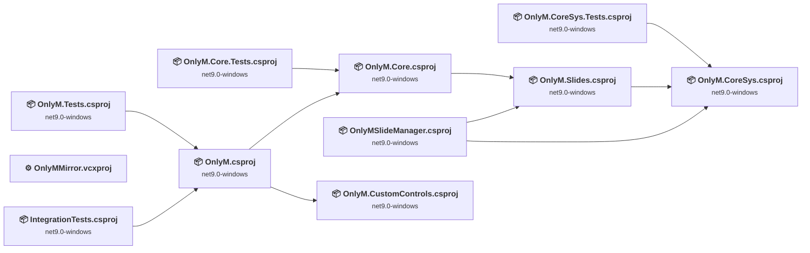

## Project Details

### IntegrationTests\IntegrationTests.csproj

#### Project Info

- **Current Target Framework:** net9.0-windows
- **Proposed Target Framework:** net10.0-windows
- **SDK-style**: True
- **Project Kind:** Wpf
- **Dependencies**: 1
- **Dependants**: 0
- **Number of Files**: 11
- **Number of Files with Incidents**: 4
- **Lines of Code**: 232
- **Estimated LOC to modify**: 17+ (at least 7.3% of the project)

#### Dependency Graph

Legend:
📦 SDK-style project
⚙️ Classic project

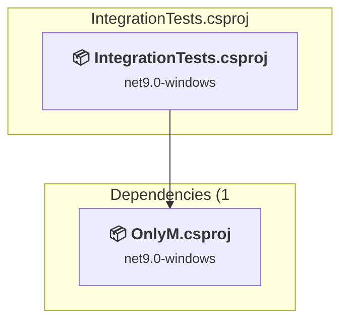

### API Compatibility

| Category | Count | Impact |
| :--- | :---: | :--- |
| 🔴 Binary Incompatible | 10 | High - Require code changes |
| 🟡 Source Incompatible | 7 | Medium - Needs re-compilation and potential conflicting API error fixing |
| 🔵 Behavioral change | 0 | Low - Behavioral changes that may require testing at runtime |
| ✅ Compatible | 276 |  |
| ***Total APIs Analyzed*** | ***293*** |  |

#### Project Technologies and Features

| Technology | Issues | Percentage | Migration Path |
| :--- | :---: | :---: | :--- |
| WPF (Windows Presentation Foundation) | 10 | 58.8% | WPF APIs for building Windows desktop applications with XAML-based UI that are available in .NET on Windows. WPF provides rich desktop UI capabilities with data binding and styling. Enable Windows Desktop support: Option 1 (Recommended): Target net9.0-windows; Option 2: Add <UseWindowsDesktop>true</UseWindowsDesktop>. |
| GDI+ / System.Drawing | 7 | 41.2% | System.Drawing APIs for 2D graphics, imaging, and printing that are available via NuGet package System.Drawing.Common. Note: Not recommended for server scenarios due to Windows dependencies; consider cross-platform alternatives like SkiaSharp or ImageSharp for new code. |

### OnlyM.Core.Tests\OnlyM.Core.Tests.csproj

#### Project Info

- **Current Target Framework:** net9.0-windows
- **Proposed Target Framework:** net10.0--windows
- **SDK-style**: True
- **Project Kind:** DotNetCoreApp
- **Dependencies**: 1
- **Dependants**: 0
- **Number of Files**: 8
- **Number of Files with Incidents**: 3
- **Lines of Code**: 903
- **Estimated LOC to modify**: 19+ (at least 2.1% of the project)

#### Dependency Graph

Legend:
📦 SDK-style project
⚙️ Classic project

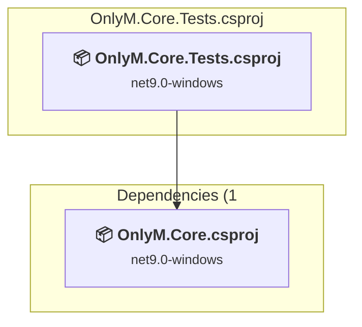

### API Compatibility

| Category | Count | Impact |
| :--- | :---: | :--- |
| 🔴 Binary Incompatible | 4 | High - Require code changes |
| 🟡 Source Incompatible | 0 | Medium - Needs re-compilation and potential conflicting API error fixing |
| 🔵 Behavioral change | 15 | Low - Behavioral changes that may require testing at runtime |
| ✅ Compatible | 1075 |  |
| ***Total APIs Analyzed*** | ***1094*** |  |

### OnlyM.Core\OnlyM.Core.csproj

#### Project Info

- **Current Target Framework:** net9.0-windows
- **Proposed Target Framework:** net10.0-windows
- **SDK-style**: True
- **Project Kind:** Wpf
- **Dependencies**: 1
- **Dependants**: 2
- **Number of Files**: 91
- **Number of Files with Incidents**: 18
- **Lines of Code**: 5011
- **Estimated LOC to modify**: 158+ (at least 3.2% of the project)

#### Dependency Graph

Legend:
📦 SDK-style project
⚙️ Classic project

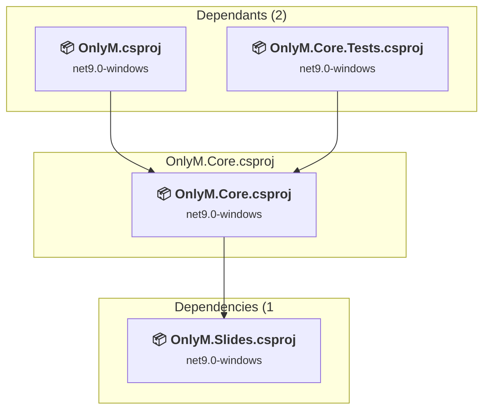

### API Compatibility

| Category | Count | Impact |
| :--- | :---: | :--- |
| 🔴 Binary Incompatible | 121 | High - Require code changes |
| 🟡 Source Incompatible | 17 | Medium - Needs re-compilation and potential conflicting API error fixing |
| 🔵 Behavioral change | 20 | Low - Behavioral changes that may require testing at runtime |
| ✅ Compatible | 4093 |  |
| ***Total APIs Analyzed*** | ***4251*** |  |

#### Project Technologies and Features

| Technology | Issues | Percentage | Migration Path |
| :--- | :---: | :---: | :--- |
| Windows Forms | 28 | 17.7% | Windows Forms APIs for building Windows desktop applications with traditional Forms-based UI that are available in .NET on Windows. Enable Windows Desktop support: Option 1 (Recommended): Target net9.0-windows; Option 2: Add <UseWindowsDesktop>true</UseWindowsDesktop>; Option 3 (Legacy): Use Microsoft.NET.Sdk.WindowsDesktop SDK. |
| GDI+ / System.Drawing | 14 | 8.9% | System.Drawing APIs for 2D graphics, imaging, and printing that are available via NuGet package System.Drawing.Common. Note: Not recommended for server scenarios due to Windows dependencies; consider cross-platform alternatives like SkiaSharp or ImageSharp for new code. |
| WPF (Windows Presentation Foundation) | 63 | 39.9% | WPF APIs for building Windows desktop applications with XAML-based UI that are available in .NET on Windows. WPF provides rich desktop UI capabilities with data binding and styling. Enable Windows Desktop support: Option 1 (Recommended): Target net9.0-windows; Option 2: Add <UseWindowsDesktop>true</UseWindowsDesktop>. |

### OnlyM.CoreSys.Tests\OnlyM.CoreSys.Tests.csproj

#### Project Info

- **Current Target Framework:** net9.0-windows
- **Proposed Target Framework:** net10.0-windows
- **SDK-style**: True
- **Project Kind:** Wpf
- **Dependencies**: 1
- **Dependants**: 0
- **Number of Files**: 2
- **Number of Files with Incidents**: 3
- **Lines of Code**: 672
- **Estimated LOC to modify**: 87+ (at least 12.9% of the project)

#### Dependency Graph

Legend:
📦 SDK-style project
⚙️ Classic project

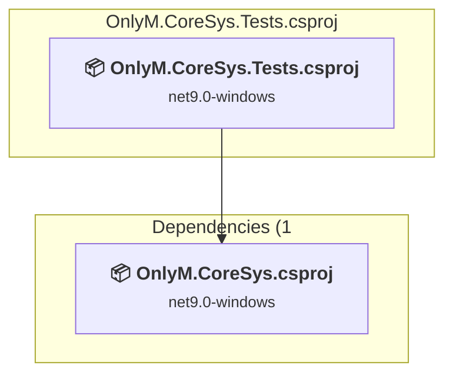

### API Compatibility

| Category | Count | Impact |
| :--- | :---: | :--- |
| 🔴 Binary Incompatible | 68 | High - Require code changes |
| 🟡 Source Incompatible | 16 | Medium - Needs re-compilation and potential conflicting API error fixing |
| 🔵 Behavioral change | 3 | Low - Behavioral changes that may require testing at runtime |
| ✅ Compatible | 639 |  |
| ***Total APIs Analyzed*** | ***726*** |  |

#### Project Technologies and Features

| Technology | Issues | Percentage | Migration Path |
| :--- | :---: | :---: | :--- |
| GDI+ / System.Drawing | 16 | 18.4% | System.Drawing APIs for 2D graphics, imaging, and printing that are available via NuGet package System.Drawing.Common. Note: Not recommended for server scenarios due to Windows dependencies; consider cross-platform alternatives like SkiaSharp or ImageSharp for new code. |
| WPF (Windows Presentation Foundation) | 41 | 47.1% | WPF APIs for building Windows desktop applications with XAML-based UI that are available in .NET on Windows. WPF provides rich desktop UI capabilities with data binding and styling. Enable Windows Desktop support: Option 1 (Recommended): Target net9.0-windows; Option 2: Add <UseWindowsDesktop>true</UseWindowsDesktop>. |

### OnlyM.CoreSys\OnlyM.CoreSys.csproj

#### Project Info

- **Current Target Framework:** net9.0-windows
- **Proposed Target Framework:** net10.0-windows
- **SDK-style**: True
- **Project Kind:** Wpf
- **Dependencies**: 0
- **Dependants**: 3
- **Number of Files**: 12
- **Number of Files with Incidents**: 5
- **Lines of Code**: 1212
- **Estimated LOC to modify**: 219+ (at least 18.1% of the project)

#### Dependency Graph

Legend:
📦 SDK-style project
⚙️ Classic project

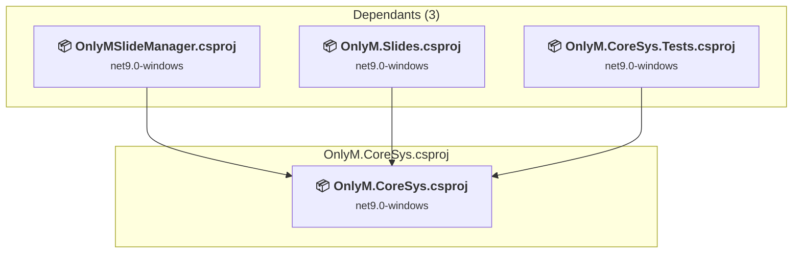

### API Compatibility

| Category | Count | Impact |
| :--- | :---: | :--- |
| 🔴 Binary Incompatible | 148 | High - Require code changes |
| 🟡 Source Incompatible | 65 | Medium - Needs re-compilation and potential conflicting API error fixing |
| 🔵 Behavioral change | 6 | Low - Behavioral changes that may require testing at runtime |
| ✅ Compatible | 910 |  |
| ***Total APIs Analyzed*** | ***1129*** |  |

#### Project Technologies and Features

| Technology | Issues | Percentage | Migration Path |
| :--- | :---: | :---: | :--- |
| GDI+ / System.Drawing | 65 | 29.7% | System.Drawing APIs for 2D graphics, imaging, and printing that are available via NuGet package System.Drawing.Common. Note: Not recommended for server scenarios due to Windows dependencies; consider cross-platform alternatives like SkiaSharp or ImageSharp for new code. |
| WPF (Windows Presentation Foundation) | 125 | 57.1% | WPF APIs for building Windows desktop applications with XAML-based UI that are available in .NET on Windows. WPF provides rich desktop UI capabilities with data binding and styling. Enable Windows Desktop support: Option 1 (Recommended): Target net9.0-windows; Option 2: Add <UseWindowsDesktop>true</UseWindowsDesktop>. |

### OnlyM.CustomControls\OnlyM.CustomControls.csproj

#### Project Info

- **Current Target Framework:** net9.0-windows
- **Proposed Target Framework:** net10.0-windows
- **SDK-style**: True
- **Project Kind:** Wpf
- **Dependencies**: 0
- **Dependants**: 1
- **Number of Files**: 10
- **Number of Files with Incidents**: 7
- **Lines of Code**: 662
- **Estimated LOC to modify**: 315+ (at least 47.6% of the project)

#### Dependency Graph

Legend:
📦 SDK-style project
⚙️ Classic project

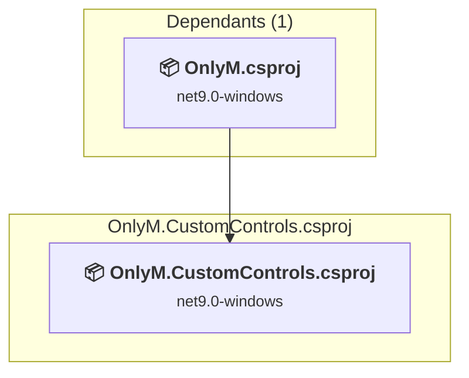

### API Compatibility

| Category | Count | Impact |
| :--- | :---: | :--- |
| 🔴 Binary Incompatible | 315 | High - Require code changes |
| 🟡 Source Incompatible | 0 | Medium - Needs re-compilation and potential conflicting API error fixing |
| 🔵 Behavioral change | 0 | Low - Behavioral changes that may require testing at runtime |
| ✅ Compatible | 300 |  |
| ***Total APIs Analyzed*** | ***615*** |  |

#### Project Technologies and Features

| Technology | Issues | Percentage | Migration Path |
| :--- | :---: | :---: | :--- |
| WPF (Windows Presentation Foundation) | 76 | 24.1% | WPF APIs for building Windows desktop applications with XAML-based UI that are available in .NET on Windows. WPF provides rich desktop UI capabilities with data binding and styling. Enable Windows Desktop support: Option 1 (Recommended): Target net9.0-windows; Option 2: Add <UseWindowsDesktop>true</UseWindowsDesktop>. |

### OnlyM.Slides\OnlyM.Slides.csproj

#### Project Info

- **Current Target Framework:** net9.0-windows
- **Proposed Target Framework:** net10.0-windows
- **SDK-style**: True
- **Project Kind:** Wpf
- **Dependencies**: 1
- **Dependants**: 2
- **Number of Files**: 11
- **Number of Files with Incidents**: 6
- **Lines of Code**: 772
- **Estimated LOC to modify**: 50+ (at least 6.5% of the project)

#### Dependency Graph

Legend:
📦 SDK-style project
⚙️ Classic project

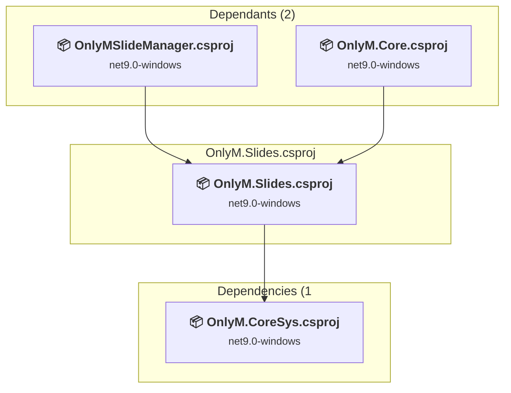

### API Compatibility

| Category | Count | Impact |
| :--- | :---: | :--- |
| 🔴 Binary Incompatible | 49 | High - Require code changes |
| 🟡 Source Incompatible | 0 | Medium - Needs re-compilation and potential conflicting API error fixing |
| 🔵 Behavioral change | 1 | Low - Behavioral changes that may require testing at runtime |
| ✅ Compatible | 727 |  |
| ***Total APIs Analyzed*** | ***777*** |  |

#### Project Technologies and Features

| Technology | Issues | Percentage | Migration Path |
| :--- | :---: | :---: | :--- |
| WPF (Windows Presentation Foundation) | 49 | 98.0% | WPF APIs for building Windows desktop applications with XAML-based UI that are available in .NET on Windows. WPF provides rich desktop UI capabilities with data binding and styling. Enable Windows Desktop support: Option 1 (Recommended): Target net9.0-windows; Option 2: Add <UseWindowsDesktop>true</UseWindowsDesktop>. |

### OnlyM.Tests\OnlyM.Tests.csproj

#### Project Info

- **Current Target Framework:** net9.0-windows
- **Proposed Target Framework:** net10.0--windows
- **SDK-style**: True
- **Project Kind:** DotNetCoreApp
- **Dependencies**: 1
- **Dependants**: 0
- **Number of Files**: 5
- **Number of Files with Incidents**: 1
- **Lines of Code**: 290
- **Estimated LOC to modify**: 0+ (at least 0.0% of the project)

#### Dependency Graph

Legend:
📦 SDK-style project
⚙️ Classic project

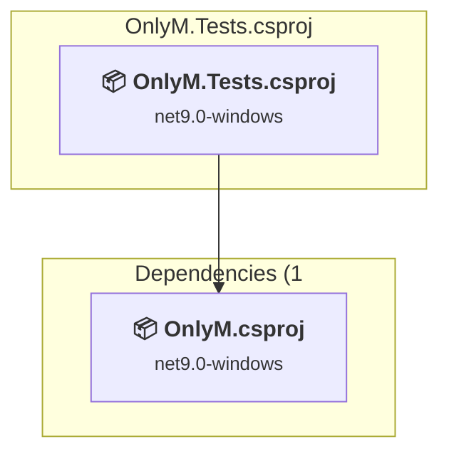

### API Compatibility

| Category | Count | Impact |
| :--- | :---: | :--- |
| 🔴 Binary Incompatible | 0 | High - Require code changes |
| 🟡 Source Incompatible | 0 | Medium - Needs re-compilation and potential conflicting API error fixing |
| 🔵 Behavioral change | 0 | Low - Behavioral changes that may require testing at runtime |
| ✅ Compatible | 368 |  |
| ***Total APIs Analyzed*** | ***368*** |  |

### OnlyM\OnlyM.csproj

#### Project Info

- **Current Target Framework:** net9.0-windows
- **Proposed Target Framework:** net10.0-windows
- **SDK-style**: True
- **Project Kind:** Wpf
- **Dependencies**: 2
- **Dependants**: 2
- **Number of Files**: 128
- **Number of Files with Incidents**: 44
- **Lines of Code**: 12896
- **Estimated LOC to modify**: 1568+ (at least 12.2% of the project)

#### Dependency Graph

Legend:
📦 SDK-style project
⚙️ Classic project

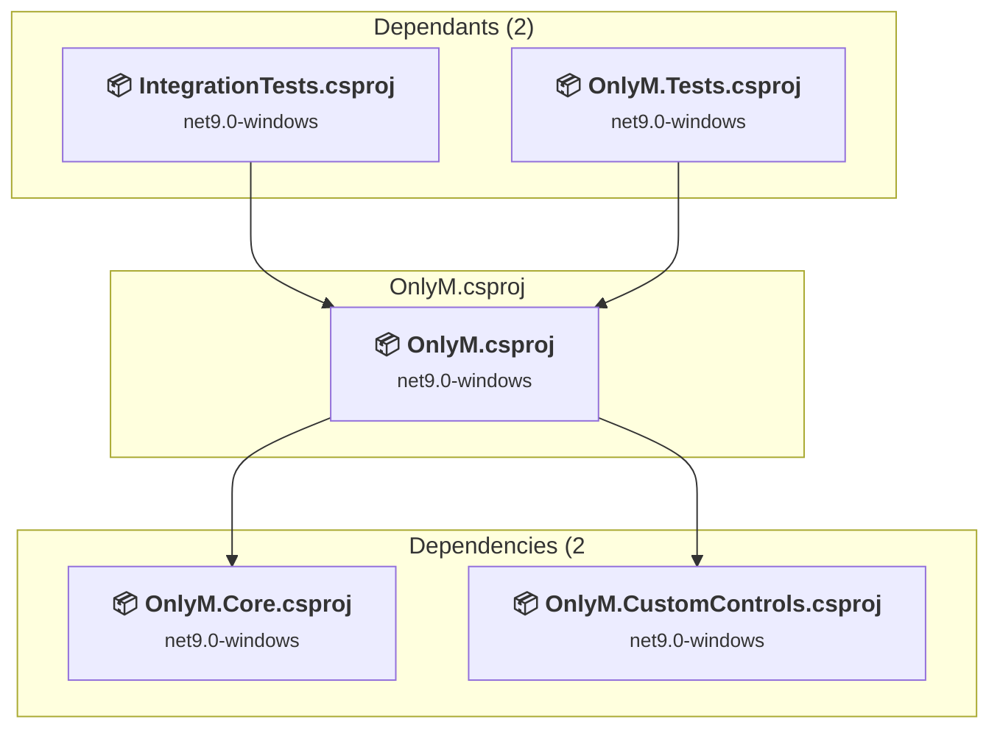

### API Compatibility

| Category | Count | Impact |
| :--- | :---: | :--- |
| 🔴 Binary Incompatible | 1493 | High - Require code changes |
| 🟡 Source Incompatible | 34 | Medium - Needs re-compilation and potential conflicting API error fixing |
| 🔵 Behavioral change | 41 | Low - Behavioral changes that may require testing at runtime |
| ✅ Compatible | 9867 |  |
| ***Total APIs Analyzed*** | ***11435*** |  |

#### Project Technologies and Features

| Technology | Issues | Percentage | Migration Path |
| :--- | :---: | :---: | :--- |
| GDI+ / System.Drawing | 18 | 1.1% | System.Drawing APIs for 2D graphics, imaging, and printing that are available via NuGet package System.Drawing.Common. Note: Not recommended for server scenarios due to Windows dependencies; consider cross-platform alternatives like SkiaSharp or ImageSharp for new code. |
| Windows Forms | 51 | 3.3% | Windows Forms APIs for building Windows desktop applications with traditional Forms-based UI that are available in .NET on Windows. Enable Windows Desktop support: Option 1 (Recommended): Target net9.0-windows; Option 2: Add <UseWindowsDesktop>true</UseWindowsDesktop>; Option 3 (Legacy): Use Microsoft.NET.Sdk.WindowsDesktop SDK. |
| WPF (Windows Presentation Foundation) | 710 | 45.3% | WPF APIs for building Windows desktop applications with XAML-based UI that are available in .NET on Windows. WPF provides rich desktop UI capabilities with data binding and styling. Enable Windows Desktop support: Option 1 (Recommended): Target net9.0-windows; Option 2: Add <UseWindowsDesktop>true</UseWindowsDesktop>. |

### OnlyMMirror\OnlyMMirror.vcxproj

#### Project Info

- **Current Target Framework:** ✅
- **SDK-style**: False
- **Project Kind:** ClassicDotNetApp
- **Dependencies**: 0
- **Dependants**: 0
- **Number of Files**: 0
- **Lines of Code**: 0
- **Estimated LOC to modify**: 0+ (at least 0.0% of the project)

#### Dependency Graph

Legend:
📦 SDK-style project
⚙️ Classic project

### API Compatibility

| Category | Count | Impact |
| :--- | :---: | :--- |
| 🔴 Binary Incompatible | 0 | High - Require code changes |
| 🟡 Source Incompatible | 0 | Medium - Needs re-compilation and potential conflicting API error fixing |
| 🔵 Behavioral change | 0 | Low - Behavioral changes that may require testing at runtime |
| ✅ Compatible | 0 |  |
| ***Total APIs Analyzed*** | ***0*** |  |

### OnlyMSlideManager\OnlyMSlideManager.csproj

#### Project Info

- **Current Target Framework:** net9.0-windows
- **Proposed Target Framework:** net10.0-windows
- **SDK-style**: True
- **Project Kind:** Wpf
- **Dependencies**: 2
- **Dependants**: 0
- **Number of Files**: 57
- **Number of Files with Incidents**: 19
- **Lines of Code**: 2668
- **Estimated LOC to modify**: 257+ (at least 9.6% of the project)

#### Dependency Graph

Legend:
📦 SDK-style project
⚙️ Classic project

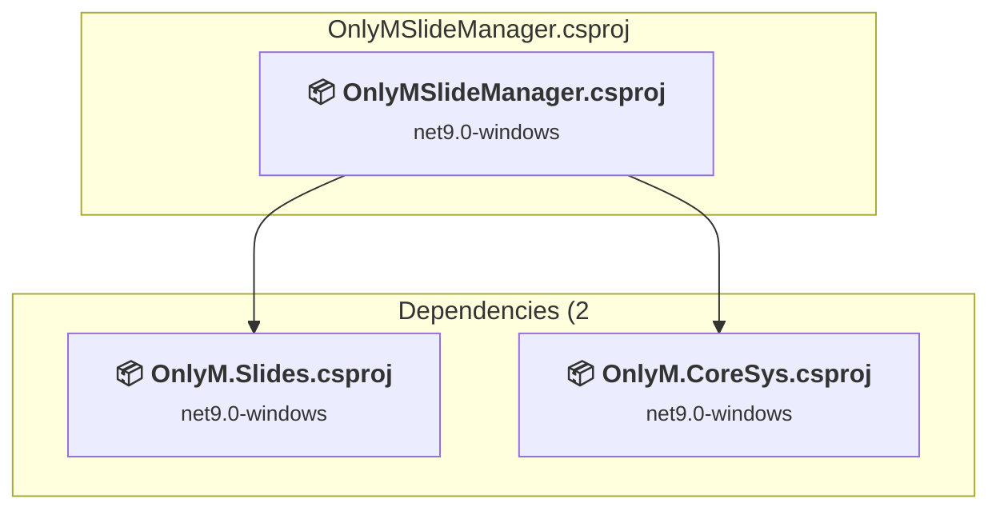

### API Compatibility

| Category | Count | Impact |
| :--- | :---: | :--- |
| 🔴 Binary Incompatible | 244 | High - Require code changes |
| 🟡 Source Incompatible | 4 | Medium - Needs re-compilation and potential conflicting API error fixing |
| 🔵 Behavioral change | 9 | Low - Behavioral changes that may require testing at runtime |
| ✅ Compatible | 2089 |  |
| ***Total APIs Analyzed*** | ***2346*** |  |

#### Project Technologies and Features

| Technology | Issues | Percentage | Migration Path |
| :--- | :---: | :---: | :--- |
| GDI+ / System.Drawing | 4 | 1.6% | System.Drawing APIs for 2D graphics, imaging, and printing that are available via NuGet package System.Drawing.Common. Note: Not recommended for server scenarios due to Windows dependencies; consider cross-platform alternatives like SkiaSharp or ImageSharp for new code. |
| WPF (Windows Presentation Foundation) | 75 | 29.2% | WPF APIs for building Windows desktop applications with XAML-based UI that are available in .NET on Windows. WPF provides rich desktop UI capabilities with data binding and styling. Enable Windows Desktop support: Option 1 (Recommended): Target net9.0-windows; Option 2: Add <UseWindowsDesktop>true</UseWindowsDesktop>. |

